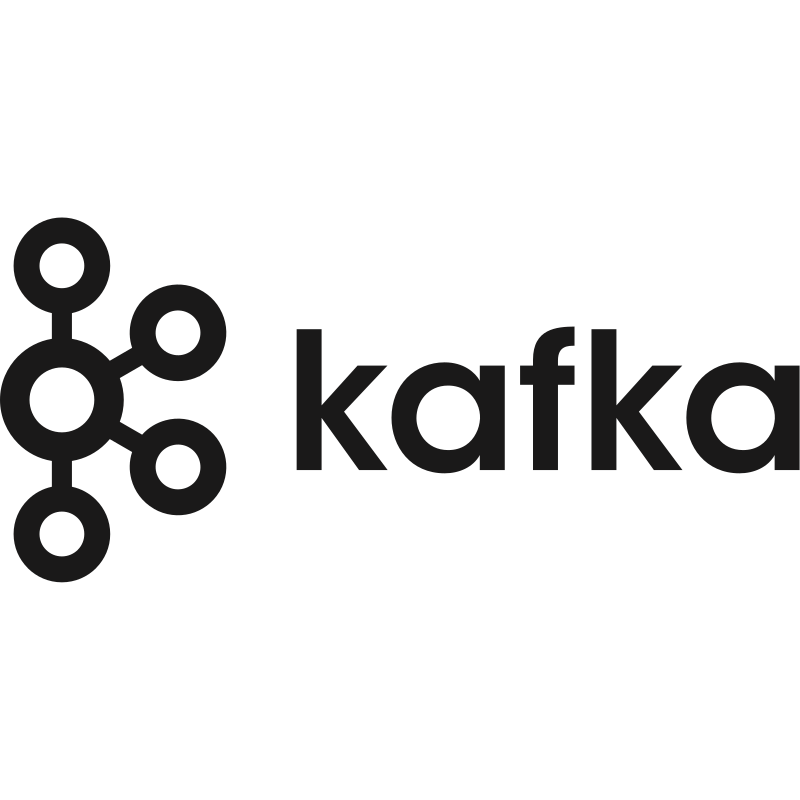
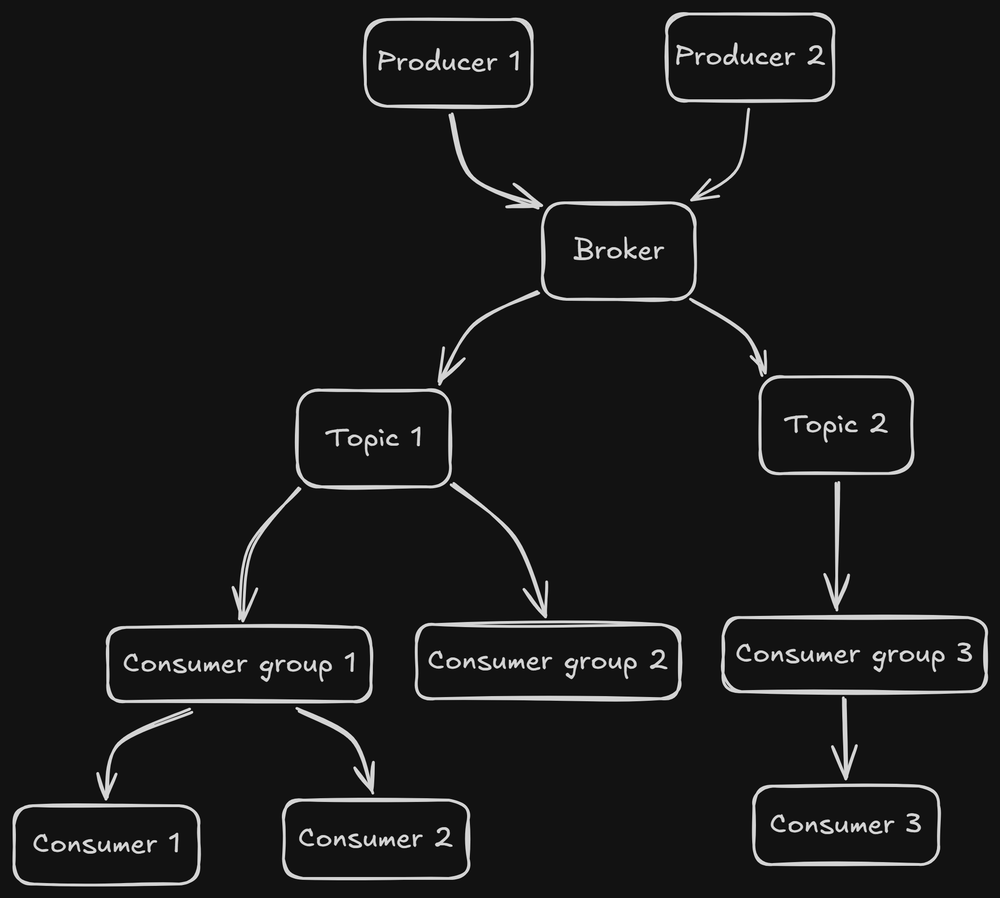
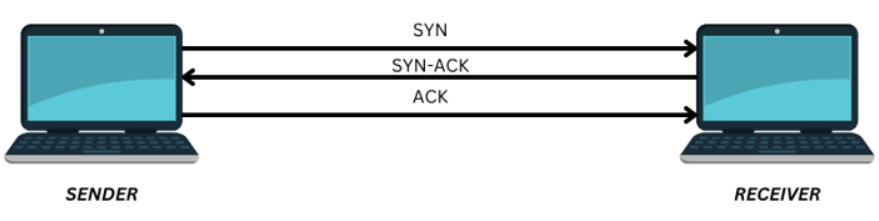
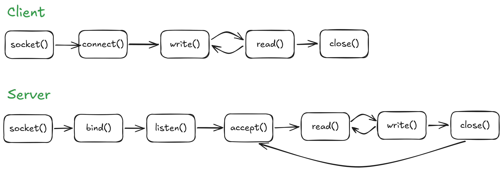

<a id="readme-top"></a>

<div align="center">
  

  <h1>KafkaGo</h1>

  <p>
    A Kafka-inspired message queue built from scratch in Go.
  </p>

  <p>
    <a href="https://golang.org/doc/go1.26"></a>
    <a href="LICENSE"></a>
    <a href="https://github.com/tranvanxuan/kafka_go/commits/master"></a>
    <a href="https://github.com/tranvanxuan/kafka_go/issues"></a>
  </p>
</div>

---

## Table of Contents

- [Description](#description)
- [Architecture](#architecture)
- [Core Concepts](#core-concepts)
- [Installation](#installation)
- [Usage](#usage)
- [Configuration](#configuration)
- [Project Structure](#project-structure)
- [ToDo](#todo)
- [License](#license)
- [Acknowledgments](#acknowledgments)

---

## Description

### 🚀 KafkaGo: A Distributed Streaming Platform in Go

**KafkaGo** is a distributed message queue built from scratch in Go, inspired by Apache Kafka.

### 🎯 Why Does This Project Exist?

> *"What I cannot create, I do not understand."* — **Richard Feynman**

To learn how Kafka really works by building it — storage, partitions, consumer groups, and the network layer, all by hand.

### ✨ Key Features

- Custom **TCP-based binary protocol** for producer/consumer communication
- **Broker** that coordinates producers, consumers, topics, and partitions
- **Topic** management with persistent metadata on disk
- **Consumer Groups** with automatic partition assignment and load balancing
- **Partition-level queues** with lock-based concurrency control
- **Buffered I/O** for high-throughput message streaming
- **At-least-once delivery** with consumer acknowledgment (commit) protocol
- Zero external dependencies beyond Go's standard library and `mmap` for storage

<p align="right">(<a href="#readme-top">back to top</a>)</p>

---

## Architecture

<div align="center">
  
</div>

The system is made up of the following components:

| Component | Description |
|---|---|
| **Broker** | The central server that coordinates all communication. Listens on port `10000`, manages topics, routes messages from producers to partitions, and pushes messages to consumers. |
| **Producer** | Connects to the Broker to register itself for a given topic, then starts a local TCP server and streams messages to the Broker. |
| **Consumer** | Connects to the Broker to register for a topic and consumer group, then starts a local TCP server and receives messages pushed by the Broker. |
| **Topic** | A logical category for messages. Each topic persists metadata to disk (`topic_<id>.dat`). |
| **Consumer Group (CGroup)** | A group of consumers sharing a subscription to a topic. The Broker assigns each consumer a dedicated partition within its group. |
| **Partition** | A sub-queue within a Consumer Group. Messages are distributed across partitions using a least-loaded strategy. Partition state is persisted to disk. |
| **Message Queue (MQ)** | A temporary in-memory buffer on the topic that holds messages when no consumer group is registered yet. |
| **Commit** | An acknowledgment sent by a consumer after processing a message, signaling to the Broker that it is ready to receive the next one. |

### Message Flow

```
Producer ──[PREG]──► Broker ──[dial back]──► Producer TCP Server
                       │
             [route by least-loaded partition]
                       │
                       ▼
              Consumer Group / Partition Queue
                       │
                 [push to consumer]
                       │
                       ▼
Consumer TCP Server ◄──── Broker ──[CREG]◄── Consumer
       │
  [process msg]
       │
  [ACK / Commit]──►──────────────────────► Broker (sends next msg)
```

### Core Concepts

#### Network Programming

Distributed systems require devices running different software and hardware to communicate reliably. KafkaGo implements a custom application protocol on top of TCP to define the format and order of messages exchanged between all components.

#### TCP Protocol

<div align="center">
  
</div>

- The Broker starts a TCP server listening on a fixed address/port.
- Producers and Consumers initiate connections to the Broker using TCP.
- After registration, the Broker dials back into the Producer/Consumer's own TCP server to maintain a persistent stream for data exchange.

#### TCP Socket Flow

<div align="center">
  
</div>

| Call | Description |
|---|---|
| `socket()` | Create a socket |
| `bind()` | Bind to a local address and port |
| `listen()` | Set the length of the connection queue |
| `accept()` | Block and wait for the next incoming connection |
| `connect()` | (Client side) Connect to a server |
| `read()` / `write()` | Exchange data over the established stream |
| `close()` | Tear down the connection |

#### Buffered I/O

KafkaGo uses Go's `bufio` package to wrap all TCP connections, batching reads and writes in user-space buffers. This significantly reduces system call overhead, improving throughput when handling high volumes of small messages.

#### Concurrency with Goroutines

Each registered Producer and Consumer connection is handled in a dedicated Goroutine, allowing the Broker to serve many connections simultaneously without blocking. Shared state (topic metadata, partitions, consumer lists) is protected with `sync.Mutex` locks.

<p align="right">(<a href="#readme-top">back to top</a>)</p>

---

## Installation

### Prerequisites

- [Go](https://golang.org/dl/) **1.21+** (the module targets `go 1.26.1`)
- Git

### Clone the repository

```bash
git clone https://github.com/tranvanxuan/kafka_go.git
cd kafka_go
```

### Install dependencies

```bash
go mod download
```

### Build

```bash
go build
```

<p align="right">(<a href="#readme-top">back to top</a>)</p>

---

## Usage

KafkaGo is operated by running three roles — **server**, **producer**, and **consumer** — as separate processes (in separate terminals).

### 1. Start the Broker

The Broker listens on port `10000` by default.

```bash
./kafka server
```

You should see:

```
debug metadata file name = broker_metadata.dat: topics = 0
```

### 2. Start a Producer

```bash
./kafka producer <port> <topicID>
```

| Argument | Description | Example |
|---|---|---|
| `port` | The local port this producer will listen on | `1100` |
| `topicID` | The topic ID to publish to | `1` |

**Example:**

```bash
./kafka producer 1100 1
```

The producer will automatically start simulating message publishing to the Broker.

### 3. Start a Consumer

```bash
./kafka consumer <port> <topicID> <groupID>
```

| Argument | Description | Example |
|---|---|---|
| `port` | The local port this consumer will listen on | `20001` |
| `topicID` | The topic ID to subscribe to | `1` |
| `groupID` | The consumer group to join | `1` |

**Example:**

```bash
./kafka consumer 12001 1 1
```

### Full Example (3 terminals)

```bash
# Terminal 1 — Broker
./kafka server

# Terminal 2 — Producer (publish to topic 1)
./kafka producer 1100 1

# Terminal 3 — Consumer (subscribe to topic 1, group 1)
./kafka consumer 12001 1 1
```

<p align="right">(<a href="#readme-top">back to top</a>)</p>

---

## Configuration

All configuration is currently done via **constants and hardcoded values** in the source files. There is no external config file yet.

| Parameter | File | Default | Description |
|---|---|---|---|
| `BrokerPort` | `brocker.go` | `10000` | TCP port the Broker listens on |
| Broker metadata file | `brocker.go` | `broker_metadata.dat` | Persisted file storing topic IDs |
| Topic metadata file | `topic.go` | `topic_metadata_<id>.dat` | Persisted file storing consumer group IDs per topic |
| CGroup metadata file | `cgroup.go` | `cgroup_metadata_<topicID>_<groupID>.dat` | Persisted file storing partition info |
| Partition data file | `partition.go` | `partition_metadata_<topicID>_<groupID>_<partitionID>.dat` | Persisted file storing the partition's message queue |

### Persistence

KafkaGo uses **memory-mapped files** (via `github.com/tidwall/mmap`) and direct binary file I/O to persist broker and topic state to disk. This means topic registrations and consumer group layouts survive across restarts.

### Dependencies

```
module kafka

go 1.26.1

require github.com/tidwall/mmap v0.3.0
require github.com/edsrzf/mmap-go v1.2.0  // indirect
require golang.org/x/sys v0.45.0           // indirect
```

<p align="right">(<a href="#readme-top">back to top</a>)</p>

---

## Project Structure

```
kafka_go/
├── main.go          # Entry point; CLI argument routing for server/producer/consumer
├── brocker.go       # Broker: TCP server, message routing, producer/consumer registration
├── producer.go      # Producer: registration with broker, simulated message publishing
├── consumer.go      # Consumer: registration with broker, message receipt and ACK
├── topic.go         # Topic: metadata management, CGroup tracking, disk persistence
├── cgroup.go        # Consumer Group: partition management, disk persistence
├── partition.go     # Partition: per-queue storage with mutex, disk persistence
├── queue.go         # Generic queue (push/pop/size) used by topics and partitions
├── message.go       # Binary message serialization/deserialization over TCP streams
├── go.mod           # Go module definition
├── go.sum           # Dependency checksums
├── docs/            # Architecture diagrams and logo assets
└── .vscode/         # Editor settings
```

<p align="right">(<a href="#readme-top">back to top</a>)</p>

---

## ToDo

- [x] **Multi-broker architecture**
- [x] **Producer**
- [x] **Topic and queue**
- [x] **Consummer and consumer groups**
- [x] **Partition replication**
- [ ] **Dockerized deployment**
- [ ] **Monitoring and metrics**
- [ ] **Better documentation**

<p align="right">(<a href="#readme-top">back to top</a>)</p>

---

## License

Distributed under the **MIT License**. See [`LICENSE`](LICENSE) for full details.

```
MIT License — Copyright (c) tranvanxuan
```

<p align="right">(<a href="#readme-top">back to top</a>)</p>

---

## Acknowledgments

This project was made possible by the following resources and inspiration:

- [Apache Kafka Documentation](https://kafka.apache.org/documentation/) — The original design and concepts that inspired this project
- [Why is TCP Called a Connection Oriented Protocol?](https://www.geeksforgeeks.org/computer-networks/why-is-tcp-called-a-connection-oriented-protocol/) — GeeksForGeeks
- [Buffered vs Unbuffered I/O on Unix](https://viniciusrocha.com/posts/buffered-vs-unbuffered-i/o-on-unix/) — Vinicius Rocha
- [Producer Delivery Semantics](https://docs.confluent.io/kafka/design/delivery-semantics.html#producer-delivery) — Confluent Documentation
- [Consumer Position Illustrated](https://docs.confluent.io/kafka/design/consumer-design.html#consumer-position-illustrated) — Confluent Documentation
- [tidwall/mmap](https://github.com/tidwall/mmap) — Memory-mapped file library for Go
- *"What I cannot create, I do not understand."* — **Richard Feynman**

<p align="right">(<a href="#readme-top">back to top</a>)</p>

---

<div align="center">
  Made with ❤️ and Go &nbsp;|&nbsp; <a href="https://github.com/tranvanxuan/kafka_go">tranvanxuan/kafka_go</a>
</div>
